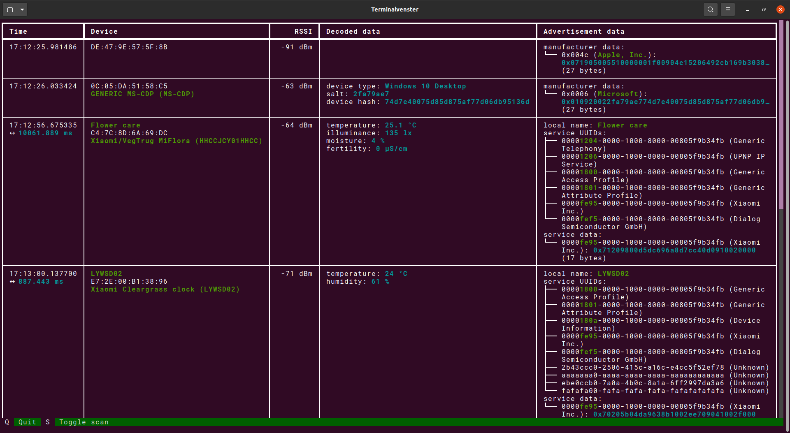

# Theengs Explorer

**Theengs Explorer** is a text user interface to discover BLE devices and show their raw advertisement data and decoded data. It leverages the [Theengs Decoder](https://github.com/theengs/decoder) library. It decodes data from a wide range of BLE sensors; LYWSD03MMC, CGD1, CGP1W, H5072, H5075, H5102, TH1, TH2, BBQ, CGH1, CGDK2, CGPR1, RuuviTag, WS02, WS08, TPMS, MiScale, LYWSD02, LYWSDCGQ, MiFlora, ...



Theengs Explorer is still in early development. To try the development version, install its dependencies [Theengs Decoder](https://decoder.theengs.io/use/python.html), [Textual](https://github.com/Textualize/textual) and [bluetooth-numbers](https://github.com/koenvervloesem/bluetooth-numbers) and run it like this:

```shell
python3 TheengsExplorer/__init__.py
```

You can use some optional arguments:

```shell
$ python3 TheengsExplorer/__init__.py --help
usage: __init__.py [-h] [-a ADAPTER] [-s {active,passive}]

optional arguments:
  -h, --help            show this help message and exit
  -a ADAPTER, --adapter ADAPTER
                        Bluetooth adapter (e.g. hci1 on Linux)
  -s {active,passive}, --scanning-mode {active,passive}
                        Scanning mode (default: active)
```

For passive scanning you need Linux kernel >= 5.10 and BlueZ >= 5.56 with experimental features enabled.

To enable experimental features in BlueZ on a Linux distribution that uses systemd, run the following command:

```shell
sudo systemctl edit bluetooth.service
```

Then add the following lines:

```
[Service]
ExecStart=
ExecStart=/usr/lib/bluetooth/bluetoothd --experimental
```

Save and close the file and then run the following commands:

```
sudo systemctl dameon-reload
sudo systemctl restart bluetooth.service
```

Note that currently Theengs Explorer has only been tested on Linux, but all libraries it depends on work on Linux, Windows and macOS. If you try it on Windows and macOS and you encounter problems, please let us know in an [issue](https://github.com/theengs/explorer/issues) or a [discussion](https://github.com/theengs/explorer/discussions/4).
